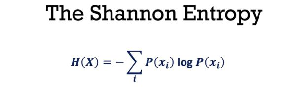

<h1>Comprehensive Exploration of the Random Forest Regressor Algorithm</h1>

<h2>Predicting the ages of crabs while exploring the random forest regressor algorithm in depth</h2>

You can view the live demo <a href="https://oyebamiji-micheal-crab-age-prediction-web-app.streamlit.app/" target="_blank">here.</a>

Credit: <a href="https://favtutor.com/blogs/types-of-regression">Favtutor</a>

<h2>Table of Contents</h2>

- [Objective](#objective)
- [What are Decision Trees and How Do They Work?](#decision_trees)
- [Let's go camping in the Random Forest](#random_forest)
- [Resources](#resources)

<h2>Objective</h2>

Almost all of my past ML projects at one point or another have used the Random Forest Algorithm. Perhaps, this is due to the fact that it is one of my favorite machine learning algorithms. My first exposure to this algorithm was when I was trying to predict whether it would rain or not in Australia using a dataset from <a href="https://www.kaggle.com/datasets/jsphyg/weather-dataset-rattle-package">Kaggle</a>. Although I have a basic grasp of its functioning, I am eager to delve deeper into its fundamentals, understanding not just the "what" but the "why" behind its operations. My intention is to master its inner workings, gain insight into when and where to apply it, and grasp key interpretative elements. 
 
In this vein, I have committed to exploring fundamental concepts and prerequisites such as decision trees, the cross-entropy function, information importance, gini index, and more. In addition, I will be dedicating a significant portion of my time to exploring and experimenting with its various hyperparameters. Ultimately, my goal is to cultivate a profound and intuitive understanding of this amazing algorithm. ❤

<h2>What are Decision Trees and How Do They Work?</h2>

At some point while I was trying to grasp the intuition behind the decision tree algorithm, I said to myself that this is just a bunch of if-else statement 😕🤷🏽‍♂️. The fancy machine learning magic actually comes from determining the optimal split for each node in the tree. <strong>Information Gain</strong> and <strong>Gini Importance</strong> are two popular splitting criterion when it comes to the decision of choosing the best attribute at each node. Though this repository is not the place for a detailed mathematical explanation, below are some of the key points I was able to learn along the way however:

- 
The model's choice of split at a particular node is determined by a concept called <strong>entropy</strong>. Entropy measures the average level of information or uncertainty contained in a state. Here, 'state' simply means a tree node.
 

- 
The higher the entropy, the more uncertain we are about a split. For example, given equal number of observations for two different classes say at the root node, then the entropy at this state will be one - indicating a high uncertainty.

- 
For every node in the decision tree, the model chooses the split that maximizes information gain. Information gain is simply the entropy of a parent node minus the combined entropy of the child node.

Another concept I picked up along the way is <strong>Gini Index</strong>. Gini Index often referred to as <strong>'Impurity'</strong> is the probability of incorrectly classifying random data point in the dataset if it were labeled based on the class distribution of the dataset. In order words,  it is measure of how pure the resulting node of a split will be.

Some of the popular decision tree algorithms include CART and ID3. The CART algorithm uses <strong>gini index</strong> for selecting the 'best feature' while ID3 uses entropy. It is worth including that the scikit-learn library uses an optimized version of the CART algorithm

<h2>Let's go camping in the Random Forest 😃</h2>

Random forest is a collection of multiple random trees. The problem with decision trees comes from their high sensitivity to even the slightest change in the training data. Also, they easily overfit and do not generalize well on new inputs. To solve these problems, we simply trained many random trees and combine their results. For classification tasks, the output class is determined by a form of voting, while regression uses the average.

<h2>Resources</h2>

- [What is a Decision Tree? - IBM](https://www.ibm.com/topics/decision-trees)
- [Entropy - Wikipedia](https://en.wikipedia.org/wiki/Entropy_(information_theory))
- [Normalized Nerd](https://www.youtube.com/c/NormalizedNerd)